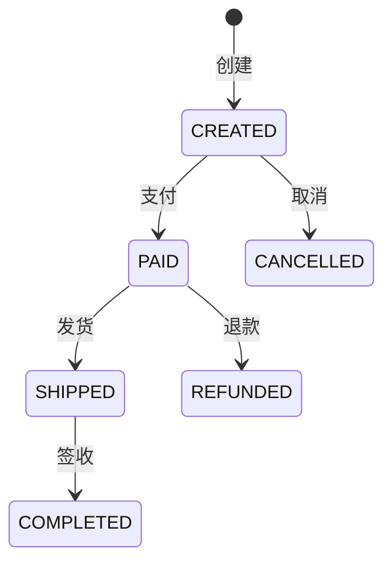

# Phase 2: Detailed Design Protocol (详细设计)

将战略设计转化为可执行的详细设计，聚焦**业务独有的逻辑**。

---

## 📋 Pre-Check (设计前检查)

* **必须读取**: `.business/{Feature}/01_Design.md` (战略设计文档)
* **确认设计已通过审核**

---

## Step 2.1: 业务流程设计

**Goal**: 将每个核心用例转化为详细的业务流程。

**输出格式**:

### 用例: {用例名称}

**主流程 (Happy Path)**:
1. 用户发起请求
2. 系统校验参数
3. 执行业务逻辑
4. 持久化数据
5. 返回结果

**异常流程**:
- 2a. 参数校验失败 → 返回 400 错误
- 3a. 业务规则不满足 → 抛出领域异常

---

## Step 2.2: 核心伪代码 (Core Pseudocode)

**Goal**: 用伪代码描述核心业务逻辑，聚焦"这个业务独有的逻辑是什么"。

> ⚠️ **注意**: 不要写 `Controller -> Service -> Dao` 这种通用废话，聚焦领域层的 if/else/try-catch。

**模板**:

```java
// === 应用层编排 ===
@Transactional
public OrderDTO createOrder(CreateOrderCmd cmd) {
    // 1. 权限/前置校验
    User user = userRepository.findById(cmd.getUserId())
        .orElseThrow(() -> new UserNotFoundException(cmd.getUserId()));
    
    // 2. 调用领域层核心逻辑
    Order order = Order.create(cmd.getItems(), user);
    
    // 3. 持久化
    orderRepository.save(order);
    
    // 4. 发布领域事件（如有）
    eventPublisher.publish(new OrderCreatedEvent(order.getId()));
    
    return OrderAssembler.toDTO(order);
}

// === 领域层核心逻辑（重点描述！） ===
public static Order create(List<OrderItem> items, User user) {
    // 业务规则1: 订单不能为空
    if (items == null || items.isEmpty()) {
        throw new OrderEmptyException("订单项不能为空");
    }
    
    // 业务规则2: 计算总金额
    Money total = items.stream()
        .map(OrderItem::getSubtotal)
        .reduce(Money.ZERO, Money::add);
    
    // 业务规则3: VIP 用户享受折扣
    if (user.isVip()) {
        total = total.multiply(0.9);  // 9折
    }
    
    // 业务规则4: 总金额不能为负
    if (total.isNegative()) {
        throw new InvalidOrderAmountException("订单金额不能为负");
    }
    
    return new Order(generateId(), items, total, OrderStatus.CREATED);
}
```

**关键点**:
- 每个 `if` 判断都对应一个业务规则
- 每个 `throw` 都对应一个异常场景
- 开发人员可直接将伪代码转化为真实代码

---

## Step 2.3: 状态机设计 (如有)

**Goal**: 定义实体的状态流转规则。

**模板**:



| 当前状态 | 事件 | 目标状态 | 前置条件 | 业务规则 |
|---------|------|---------|---------|---------|
| CREATED | pay() | PAID | 金额 > 0 | 校验库存充足 |
| CREATED | cancel() | CANCELLED | - | 释放锁定库存 |
| PAID | ship() | SHIPPED | 有库存 | 扣减实际库存 |

---

## Step 2.4: 边界条件与校验规则

**Goal**: 列出所有需要校验的边界条件。

**模板**:

| 层级 | 校验点 | 规则 | 失败处理 |
|------|--------|------|---------|
| Interface | 参数非空 | @NotNull/@NotBlank | 400 Bad Request |
| Application | 权限校验 | 用户是否有权限 | 403 Forbidden |
| Domain | 业务不变量 | 订单金额 >= 0 | DomainException |
| Domain | 状态约束 | 已取消订单不能支付 | IllegalStateException |

---

## Step 2.5: 数据转换规则

**Goal**: 定义各层之间的数据转换规则。

**模板**:

| 源类型 | 目标类型 | 转换器 | 关键逻辑 |
|--------|---------|--------|---------|
| CreateOrderRequest | CreateOrderCmd | Controller | 直接映射 |
| CreateOrderCmd | Order | Factory | 调用 Order.create() |
| Order | OrderPO | Converter | 嵌套对象拆平 |
| OrderPO | Order | Converter | 重建聚合 |
| Order | OrderDTO | Assembler | 只暴露必要字段 |

---

## 📝 Final Deliverable (最终交付物)

完成上述步骤后，生成 `.business/{Feature}/02_DetailedDesign.md`，包含：

```markdown
# {Feature} 详细设计说明书

## 1. 业务流程
### 1.1 用例1: xxx
(主流程 + 异常流程)

## 2. 核心伪代码
```java
// 领域层核心逻辑
```

## 3. 状态机 (如有)
(Mermaid 状态图 + 状态转换表)

## 4. 边界条件与校验规则
(校验点列表)

## 5. 数据转换规则
(转换表)
```

---

## 🛑 Stop Point (用户审核节点)

**详细设计完成后:**
1. 输出: "📋 详细设计已生成：`.business/{Feature}/02_DetailedDesign.md`"
2. 询问: "请审核详细设计。输入 **'通过'** 进入任务规划阶段 (Phase 3)。"
3. **严禁**: 在用户确认前进入下一阶段。
