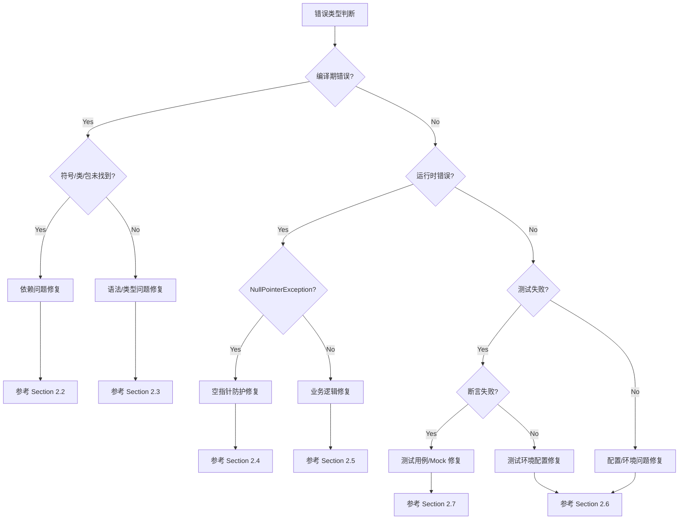

# Phase X: Debugging & Recovery Protocol

**Tech Lead 指令**: 停止无效的循环读取！我们不需要看完整的日志，只需要看**第一个致命错误**。

## 🎯 推荐方案: Python 日志分析工具

**为了避免 PowerShell 输出截断问题**，我们提供了专门的 Python 脚本来解析错误日志。

### 快速使用

```bash
# 生成 Bug 报告（推荐）
python script/log_analyzer.py -l "LOG_PATH" -o .business/{Feature}/Bug_Analysis.md --bug-report

# 生成详细分析报告
python script/log_analyzer.py -l "LOG_PATH" -o .business/{Feature}/Error_Analysis.md

# 如果没有发现错误，查看末尾 50 行
python script/log_analyzer.py -l "LOG_PATH" --tail 50
```

### 优势

- ✅ **不会截断**: 输出保存到文件，完整保留所有信息
- ✅ **智能分析**: 自动识别错误类型和根本原因
- ✅ **结构化报告**: 生成易读的 Markdown 格式报告
- ✅ **灵活配置**: 支持自定义错误数量、上下文行数等

📖 详细使用说明: [script/README.md](../script/README.md)

---

## 备选方案: PowerShell 命令

如果无法使用 Python，可以使用以下 PowerShell 命令（可能遇到截断问题）:

## 🛑 Circuit Breaker (熔断机制)
**Rule**: 针对同一个 Log 文件，**严禁**执行超过 1 次读取命令。
* **One Shot**: 必须使用下方定义的“精确打击”命令，一次性获取所需信息。
* **Stop**: 如果命令返回为空或无意义信息，**立即停止**并请求人工介入，严禁尝试使用 `type`、`cat` 或复杂的正则去重读文件。

## 1. 🔍 Diagnosis Protocol (诊断步骤)

**Data Source**: `.business/{Feature}/executelogs/` 下的目标日志文件。

### Step 1: Precision Strike (精确打击 - 强制执行)

**Rationale**: Maven/Java 的错误往往是级联的。修复前 5 个错误通常能解决 90% 的问题。
**Command (PowerShell Optimized)**:
请直接执行以下命令（不要修改参数）：

```powershell
Get-Content -Path "LOG_PATH" -Encoding UTF8 | Select-String -Pattern "\[ERROR\]|Caused by|FAILURE" -Context 0,20 | Select-Object -First 5 | Out-String -Width 4096

```

* **原理解析**:
* `Select-String -Pattern ...`: 同时捕获编译错误(`[ERROR]`)、构建失败(`FAILURE`)和运行时异常(`Caused by`)。
* `-Context 0,20`: **核心**。对于每一行错误，自动抓取其后 **20行**（即堆栈详情）。
* `Select-Object -First 5`: **防刷屏**。只看前 5 个错误，防止 Token 溢出或日志过长被截断。
* `Out-String -Width 4096`: **防截断**。强制扩展 PowerShell 的行宽，防止 Java 长类名被切断。


### Step 2: Fallback (备选策略 - 仅当 Step 1 输出为空时)

如果 Step 1 真的什么都没抓到（罕见情况，如 JVM 崩溃），则读取文件末尾的摘要：

```powershell
Get-Content -Path "LOG_PATH" -Encoding UTF8 -Tail 50 | Out-String -Width 4096

```

### Step 3: Analysis Report (必填)

根据 Step 1 输出的片段，填写报告：

> **[Bug Report]**
> * **Failure Type**: (e.g., `SymbolNotFound`, `CompilationError`)
> * **Location**: (e.g., `OrderService.java:[15,20]`)
> * **Key Trace**:
> ```text
> [ERROR] /C:/.../OrderService.java:[15,20] cannot find symbol
> [ERROR]   symbol:   class Money
> 
> ```
>
>
> * **Root Cause**: (一句话解释原因)
>
>

## 2. 🛠️ Fix Strategy (修复策略)

### 2.1 错误分类决策树



---

### 2.2 依赖问题修复（Import/Package/Symbol Not Found）

#### 📋 检查清单
1. **检查导入语句**
   ```bash
   # 定位缺失的类
   grep -r "class Money" src/main/java/
   ```

2. **检查 Maven 依赖**
   ```bash
   # 查看依赖树，确认缺失的依赖
   mvn dependency:tree | grep -i "money"
   ```

3. **常见修复方式**

| 错误信息 | 可能原因 | 修复方法 |
|---------|---------|---------|
| `cannot find symbol: class XXX` | 缺少 import 或类不存在 | 1. 添加 `import` 语句<br>2. 检查类名拼写<br>3. 确认类在 classpath 中 |
| `package xxx does not exist` | Maven 依赖缺失 | 在 `pom.xml` 添加依赖 |
| `cannot find symbol: variable xxx` | 变量未声明或作用域错误 | 检查变量声明位置 |

#### 🔧 修复示例
```diff
# 场景：缺少 Money 类的导入
+ import com.example.domain.valueobject.Money;

  public class OrderService {
      public void calculateTotal(Order order) {
-         // Money total = ...; // 编译错误
+         Money total = order.getTotalAmount(); // 正确
      }
  }
```

#### 🎯 DDD 特定问题
- **跨模块依赖**：检查 `pom.xml` 是否包含其他模块的依赖
  ```xml
  <dependency>
      <groupId>com.example</groupId>
      <artifactId>domain-core</artifactId>
      <version>${project.version}</version>
  </dependency>
  ```
- **值对象未暴露**：确认值对象在领域层的 `package-info.java` 中正确导出

---

### 2.3 语法/类型问题修复（Compilation Error）

#### 📋 检查清单
1. **类型不匹配**
   ```java
   // 常见错误：返回类型不匹配
   public String getName() {
       return 123; // ❌ 类型错误
   }
   ```

2. **泛型问题**
   ```java
   // 常见错误：泛型使用不当
   List<String> names = new ArrayList<>();
   names.add(123); // ❌ 类型错误
   ```

3. **方法签名错误**
   - 接口实现的方法签名不匹配
   - 重写方法的参数类型不一致

#### 🔧 修复策略
- **使用 IDE 提示**：大多数 IDE 会提供快速修复建议
- **检查接口契约**：确保实现类严格遵守接口定义
- **类型转换**: 必要时添加正确的类型转换

---

### 2.4 空指针防护修复（NullPointerException）

#### 📋 常见场景
1. **未初始化的字段**
   ```java
   private List<Item> items; // ❌ null
   
   public void addItem(Item item) {
       items.add(item); // NPE!
   }
   ```

2. **外部依赖返回 null**
   ```java
   User user = userRepository.findById(id); // 可能返回 null
   String name = user.getName(); // NPE!
   ```

3. **Optional 误用**
   ```java
   Optional<User> userOpt = findUser(id);
   User user = userOpt.get(); // 如果为空会抛异常
   ```

#### 🔧 修复模式

**模式 1: 防御性初始化**
```diff
- private List<Item> items;
+ private List<Item> items = new ArrayList<>();
```

**模式 2: 空值检查**
```diff
  User user = userRepository.findById(id);
+ if (user == null) {
+     throw new UserNotFoundException(id);
+ }
  String name = user.getName();
```

**模式 3: Optional 正确使用**
```diff
  Optional<User> userOpt = findUser(id);
- User user = userOpt.get();
+ User user = userOpt.orElseThrow(() -> new UserNotFoundException(id));
```

**模式 4: DDD 值对象不变性**
```java
// 值对象应该在构造时验证非空
public class Money {
    private final BigDecimal amount;
    
    public Money(BigDecimal amount) {
        this.amount = Objects.requireNonNull(amount, "金额不能为空");
    }
}
```

---

### 2.5 业务逻辑修复（Logic Error）

#### 📋 检查清单
1. **领域模型一致性**
   - 聚合根是否维护了不变性约束？
   - 领域事件是否正确发布？

2. **业务规则验证**
   - 是否遗漏了业务规则校验？
   - 状态机转换是否合法？

3. **DDD 分层职责检查**
   ```
   Controller (接口层)
       ↓ 不要写业务逻辑
   Application Service (应用层)
       ↓ 编排领域服务，不要写核心业务逻辑
   Domain Service (领域层)
       ↓ 核心业务逻辑应该在这里
   Repository (仓储层)
       ↓ 只负责持久化
   ```

#### 🔧 修复示例

**反例：应用层包含领域逻辑**
```java
// ❌ 错误：在应用层计算订单总额
@Service
public class OrderApplicationService {
    public void createOrder(OrderDTO dto) {
        BigDecimal total = BigDecimal.ZERO;
        for (ItemDTO item : dto.getItems()) {
            total = total.add(item.getPrice().multiply(item.getQuantity()));
        }
        // ...
    }
}
```

**正例：领域层封装业务逻辑**
```java
// ✅ 正确：在领域模型中计算
@Service
public class OrderApplicationService {
    public void createOrder(OrderDTO dto) {
        Order order = orderFactory.create(dto);
        Money total = order.calculateTotal(); // 领域逻辑封装在聚合根
        // ...
    }
}

// 领域层
public class Order {
    private List<OrderItem> items;
    
    public Money calculateTotal() {
        return items.stream()
            .map(OrderItem::getSubtotal)
            .reduce(Money.ZERO, Money::add);
    }
}
```

---

### 2.6 配置/环境问题修复（Config/Environment）

#### 📋 常见问题速查表

| 错误信息 | 可能原因 | 修复方法 |
|---------|---------|---------|
| `@MapperScan` 找不到 Mapper | 包扫描路径错误 | 检查 `@MapperScan("com.example.*.infrastructure.persistence.mapper")` |
| Lombok 不生效 | IDE 插件未安装或版本不兼容 | 1. 安装 Lombok 插件<br>2. Enable Annotation Processing |
| `application.yml` 配置未生效 | 配置文件位置错误或格式错误 | 确保在 `src/main/resources/` 下且 YAML 格式正确 |
| 数据库连接失败 | 配置错误或数据库未启动 | 检查 `spring.datasource.*` 配置 |
| Redis 连接失败 | Redis 未启动 | 启动 Redis 或调整连接配置 |
| 端口占用 | 其他进程占用端口 | 修改 `server.port` 或停止占用进程 |

#### 🔧 配置文件检查工具

```bash
# 检查配置文件语法
python -c "import yaml; yaml.safe_load(open('src/main/resources/application.yml'))"

# 检查有效的 Spring 配置
mvn spring-boot:run -Ddebug
```

#### 🎯 DDD 项目常见配置坑

1. **MyBatis Mapper 扫描路径**
   ```java
   // ❌ 错误：只扫描了一个模块
   @MapperScan("com.example.user.infrastructure.persistence.mapper")
   
   // ✅ 正确：扫描所有模块
   @MapperScan("com.example.*.infrastructure.persistence.mapper")
   ```

2. **多模块依赖版本不一致**
   ```xml
   <!-- 使用统一的版本管理 -->
   <dependencyManagement>
       <dependencies>
           <dependency>
               <groupId>com.example</groupId>
               <artifactId>domain-core</artifactId>
               <version>${project.version}</version>
           </dependency>
       </dependencies>
   </dependencyManagement>
   ```

---

### 2.7 测试用例/Mock 修复（Test Error）

#### 📋 检查清单
1. **断言错误**
   - 期望值是否正确？
   - 是否使用了正确的断言方法？

2. **Mock 配置错误**
   - Mock 对象行为定义是否完整？
   - 是否模拟了所有必要的依赖？

3. **测试数据问题**
   - 测试数据是否符合业务规则？
   - 是否覆盖了边界条件？

#### 🔧 常见 Mock 错误修复

**问题 1: Mock 返回 null**
```diff
  @Mock
  private UserRepository userRepository;
  
  @Test
  public void testGetUserName() {
-     // userRepository.findById() 返回 null
+     when(userRepository.findById(1L))
+         .thenReturn(Optional.of(new User(1L, "张三")));
      
      String name = userService.getUserName(1L);
      assertEquals("张三", name);
  }
```

**问题 2: 验证失败**
```diff
  @Test
  public void testCreateUser() {
      userService.createUser(new UserDTO("张三"));
      
-     verify(userRepository).save(any()); // 可能过于宽松
+     verify(userRepository).save(argThat(user -> 
+         "张三".equals(user.getName())
+     ));
  }
```

**问题 3: DDD 测试 - 领域事件验证**
```java
@Test
public void testOrderCreated_shouldPublishEvent() {
    // Arrange
    Order order = new Order();
    
    // Act
    order.confirm();
    
    // Assert - 验证领域事件
    List<DomainEvent> events = order.getDomainEvents();
    assertThat(events).hasSize(1);
    assertThat(events.get(0)).isInstanceOf(OrderConfirmedEvent.class);
}
```

---

### 2.8 修复决策优先级

按以下顺序排查和修复，通常效率最高：

1. **先修编译错误** → 代码无法运行
2. **再修配置错误** → 环境问题会掩盖真正的业务 Bug
3. **然后修空指针** → 最常见的运行时错误
4. **接着修业务逻辑** → 核心功能问题
5. **最后修测试用例** → 确保回归测试通过

### 2.9 修复模板

每次修复后，按以下格式记录：

```markdown
### 修复记录

**错误类型**: [SymbolNotFound / NullPointer / LogicError / ConfigError / TestError]

**根本原因**: 
- 一句话说明为什么会出现这个错误

**修复方案**: 
- 采用了哪种修复策略（引用上述 2.2-2.7 小节）

**代码变更**:
```diff
[显示关键的 diff]
```

**验证方法**:
- 如何验证修复是否成功
```

---

## 3. 🔄 Verification (回归验证)

修复后，仅重跑刚才失败的那个测试。
**Command**: `cmd /c "chcp 65001 >nul && mvn test -Dtest={FixedClass} > .business/{Feature}/executelogs/Retry_Fix.log 2>&1"`

---

## 📂 Traceability

将本次排查报告追加保存至: `.business/{Feature}/Bug_Analysis.md`
