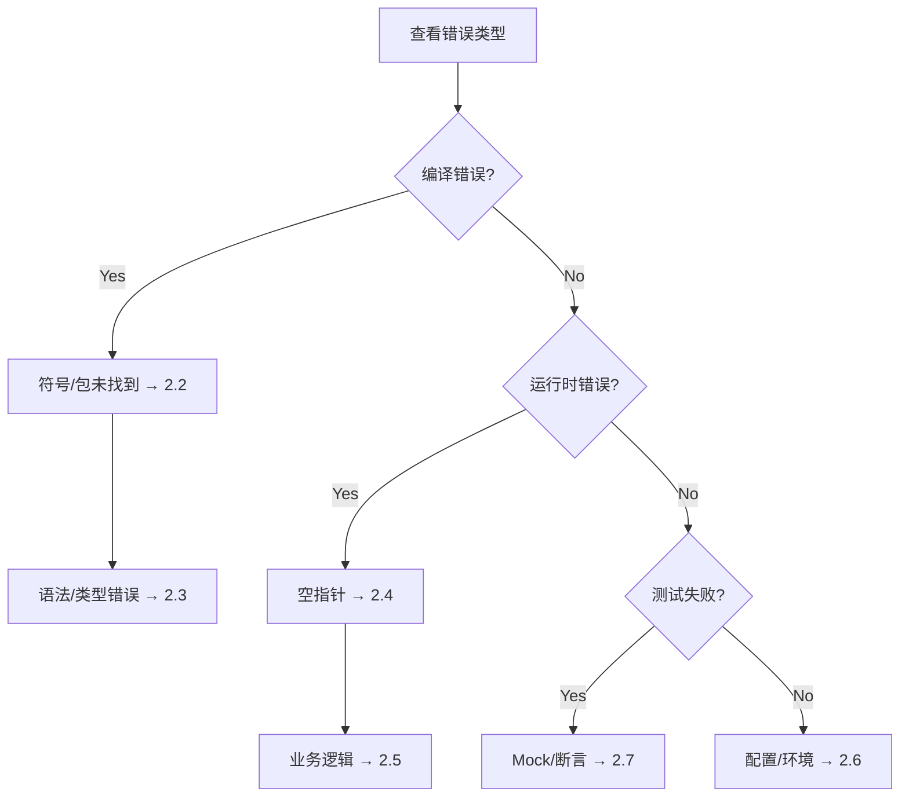

# Phase X: Debugging & Recovery Protocol

**Tech Lead 指令**: 停止无效的循环读取！我们不需要看完整的日志，只需要看**第一个致命错误**。

---

## 🛑 Circuit Breaker (熔断机制)

**Rule**: 针对同一个 Log 文件，**严禁**执行超过 1 次读取命令。
- **One Shot**: 使用工具一次性获取错误信息
- **Stop**: 如果命令返回为空或无意义信息，**立即停止**并请求人工介入

---

## 1. 🔍 错误诊断 (Diagnosis)

### 标准流程

```bash
# Step 1: 导航到脚本目录
cd .business/_Global_Protocols/ddd-backend/script

# Step 2: 分析日志（自动选择最新日志）
python analyze.py {FeatureName}

# Step 3: 查看生成的报告
# 报告位置: .business/{FeatureName}/Bug_Report.md
```

### 高级选项

```bash
# 指定特定日志文件
python analyze.py {FeatureName} Build_Phase2_20260114.log

# 手动指定编码（如果自动检测不准确）
python log_analyzer.py -l LOG_PATH -e gbk -o report.md

# 查看末尾（如果没发现错误）
python log_analyzer.py -l LOG_PATH --tail 50
```

### 输出说明

工具会自动：
- 📝 检测编码（GBK/UTF-8/GB2312）
- 🔍 提取前 5 个错误及堆栈跟踪
- 📊 识别错误类型和 DDD 分层
- 💡 提供针对性修复建议
- 💾 保存完整报告到 Bug_Report.md

📖 **详细文档**: [工具使用指南](../script/PATH_HANDLING.md)

---

## 2. 🛠️ 错误修复 (Fix Strategy)

### 决策流程

1. **查看 Bug_Report.md** → 了解错误类型
2. **参考决策树** → 定位修复方向（见下图）
3. **应用修复模式** → 根据错误类型查阅详细文档
4. **验证修复** → 重跑测试

### 错误分类决策树



### 常见错误速查

| 错误类型 | 快速检查 | 详细文档 |
|---------|---------|---------|
| **符号未找到** | 检查 import 和 pom.xml | [Section 2.2](#22-依赖问题) |
| **编译错误** | 检查类型和泛型 | [Section 2.3](#23-语法类型问题) |
| **空指针** | 检查初始化和 null 检查 | [Section 2.4](#24-空指针问题) |
| **业务逻辑** | 检查 DDD 分层职责 | [Section 2.5](#25-业务逻辑问题) |
| **配置错误** | 检查 application.yml | [Section 2.6](#26-配置环境问题) |
| **测试失败** | 检查 Mock 和断言 | [Section 2.7](#27-测试问题) |

### 2.2 依赖问题
- ✅ 添加 import 语句
- ✅ 检查 pom.xml 依赖
- ✅ 确认类名拼写

### 2.3 语法/类型问题
- ✅ 检查类型匹配
- ✅ 修复泛型错误
- ✅ 确认方法签名

### 2.4 空指针问题
- ✅ 防御性初始化：`= new ArrayList<>()`
- ✅ null 检查：`if (obj == null) throw ...`
- ✅ Optional：`orElseThrow(...)`
- ✅ DDD 值对象：构造函数验证

### 2.5 业务逻辑问题
- ✅ 检查 DDD 分层：业务逻辑应在领域层
- ✅ 验证聚合根不变性
- ✅ 确认领域事件发布

### 2.6 配置/环境问题
- ✅ MyBatis: `@MapperScan("com.example.*.infrastructure.persistence.mapper")`
- ✅ Lombok: 安装插件 + Enable Annotation Processing
- ✅ 数据库: 检查连接配置和服务状态

### 2.7 测试问题
- ✅ Mock 返回值：`when(...).thenReturn(...)`
- ✅ 断言验证：`verify(...)` 和 `assertEquals(...)`
- ✅ 测试数据：确保符合业务规则

> **💡 提示**: 工具生成的 Bug_Report.md 已包含详细的修复建议和代码示例，直接查看即可。

---

## 3. 🔄 验证修复 (Verification)

```bash
# 重跑失败的测试
cmd /c "chcp 65001 >nul && mvn test -Dtest={FixedClass} > .business/{Feature}/executelogs/Retry_Fix.log 2>&1"

# 分析重试日志
python analyze.py {Feature} Retry_Fix.log
```

---

## 4. 📂 记录追踪 (Traceability)

```bash
# 将 Bug_Report.md 追加到分析历史
cat .business/{Feature}/Bug_Report.md >> .business/{Feature}/Bug_Analysis.md
```

---

## 📚 完整文档索引

| 文档 | 用途 |
|------|------|
| **[PATH_HANDLING.md](../script/PATH_HANDLING.md)** | 路径处理和快捷脚本使用指南 |
| **[README.md](../script/README.md)** | 工具完整功能说明和编码检测 |

---

## 🎯 快速参考

### 最常用命令
```bash
# 1. 分析错误
cd .business/_Global_Protocols/ddd-backend/script && python analyze.py {Feature}

# 2. 查看报告
cat .business/{Feature}/Bug_Report.md

# 3. 修复代码（根据报告建议）

# 4. 验证修复
mvn test -Dtest={Class}
```

### 典型场景
- **编译失败** → 检查 import 和依赖
- **测试失败** → 检查 Mock 和断言
- **运行时错误** → 检查空指针和配置
- **GBK 乱码** → 工具自动检测，无需处理

---

**核心原则**: 
1. 一次性获取错误信息（不重复读取）
2. 先看第一个错误（通常是根本原因）
3. 根据错误类型查阅对应章节
4. 修复后立即验证
