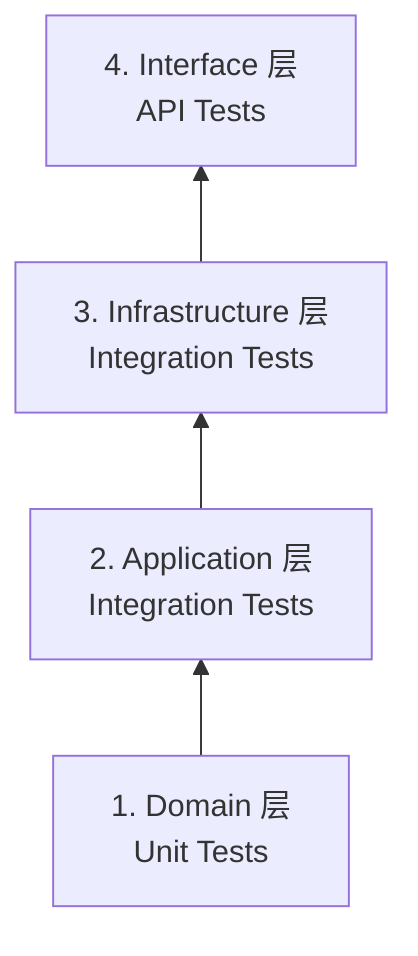

# Phase 5: Quality Protocol (Testing)

**Tech Lead 指令**: 测试不是为了证明代码"能跑"，而是为了证明代码"在任何情况下都不会崩"。

---

## 🏆 Part 1: Golden Laws（黄金法则）

### 1. Package Location Rule
* **规则**: 测试类 (`src/test/java/...`) 的包路径，必须与主启动类 (`@SpringBootApplication`) 所在的包路径**完全一致**或为其**子包**。
* **原因**: Spring Boot 的 `@SpringBootTest` 默认只扫描当前包及其子包。
    * ✅ Correct: `com.antigravity.order.domain.OrderTest`（启动类在 `com.antigravity.order`）
    * ❌ Wrong: `com.test.OrderTest`

### 2. Layer Isolation Rule（分层隔离）
* **Domain 层**: 必须写 **Unit Test**
    * **禁止**: 启动 Spring Context
    * **工具**: JUnit5 + Mockito
* **App/Infra 层**: 必须写 **Integration Test**
    * **允许**: 使用 `@SpringBootTest`
    * **覆盖**: SQL、事务、依赖注入

### 3. Assert Independence Rule
* 每个 `@Test` 方法必须独立，不依赖执行顺序
* 严禁使用 `System.out.println`，必须使用 `Assert`

---

## 📋 Part 2: 标准化测试流程（4 阶段）

### Phase 4.1: 测试规划（Planning）

**目的**: 明确测试范围，避免盲目编写测试。

**步骤**:
1. 阅读 `tasks.md` 中待测试的功能
2. **引用设计文档**: 读取 `.business/{Feature}/01_Design.md` 中的 **"关键测试场景 (TDD 思考)"** 章节
3. 基于设计文档的场景，扩展生成完整的测试矩阵（Test Matrix）
4. 请求用户审批

**Test Matrix 模板**:

| Case ID | Layer | Scenario | Input Data | Expected |
|---------|-------|----------|------------|----------|
| TC-01 | Domain | 订单金额计算 | Items=[$10, $20], VIP=True | Total=$27（9折） |
| TC-02 | Domain | 支付已取消订单 | Order.status=CANCELLED | Throw `BizException` |
| TC-03 | Infra | 根据ID查询订单 | ID=999 | Return Optional.empty |
| TC-04 | API | 创建订单参数校验 | Qty=-1 | HTTP 400 |

**输出**: 保存到 `.business/{Feature}/Test_Matrix.md`

---

### Phase 4.2: 测试实现（Implementation）

**DDD 分层测试策略**（自下而上）:



| 优先级 | 层次 | 测试类型 | 工具栈 | 重点验证 | 覆盖率要求 |
|--------|------|---------|--------|---------|-----------|
| **P0** | Domain | Unit Test | JUnit5 + Mockito | 业务逻辑、值对象、聚合根 | ≥ 80% |
| **P1** | Application | Integration Test | @SpringBootTest | 服务编排、事务 | ≥ 70% |
| **P2** | Infrastructure | Integration Test | @SpringBootTest + H2 | Repository、SQL | ≥ 60% |
| **P3** | Interface | API Test | MockMvc | Controller、参数验证 | ≥ 50% |

**测试命名规范**:
```java
// ✅ 好的命名（描述性）
@Test void shouldCalculateTotalWithVipDiscount()
@Test void shouldThrowExceptionWhenPayingCancelledOrder()

// ❌ 不好的命名
@Test void test1()
@Test void testOrder()
```

---

### Phase 4.3: 测试执行（Execution）

**增量执行**（每写完一层就运行）:

```bash
# 1. Domain 层测试
cmd /c "mvn test -Dtest=OrderTest > .business/{Feature}/executelogs/Test_Domain_{Timestamp}.log 2>&1"

# 2. Application 层测试
cmd /c "mvn test -Dtest=OrderApplicationServiceTest > .business/{Feature}/executelogs/Test_App_{Timestamp}.log 2>&1"

# 3. Infrastructure 层测试
cmd /c "mvn test -Dtest=OrderRepositoryTest > .business/{Feature}/executelogs/Test_Infra_{Timestamp}.log 2>&1"

# 4. Interface 层测试
cmd /c "mvn test -Dtest=OrderControllerTest > .business/{Feature}/executelogs/Test_API_{Timestamp}.log 2>&1"
```

**完整测试**（所有测试类）:

```bash
cmd /c "mvn test > .business/{Feature}/executelogs/Test_Full_{Timestamp}.log 2>&1"
```

**执行后立即检查退出码**（Red Light Reflex）:

```powershell
if ($LASTEXITCODE -ne 0) {
    Write-Host "🛑 测试失败！正在分析日志..." -ForegroundColor Red
    python .business/_Global_Protocols/ddd-backend/script/analyze.py .business/{Feature}/executelogs/Test_Full_{Timestamp}.log .business/{Feature}/Bug_Report.md
}
```

---

### Phase 4.4: 测试验证（Verification）

**成功标准**:
- ✅ 所有测试通过（Exit Code = 0）
- ✅ 覆盖率达标
- ✅ 无 `@Disabled` 跳过的测试

**失败处理流程**:

```bash
# 1. 自动分析日志
python .business/_Global_Protocols/ddd-backend/script/analyze.py .business/{Feature}/executelogs/Test_Full.log .business/{Feature}/Bug_Report.md

# 2. 查看错误报告
cat .business/{Feature}/Bug_Report.md

# 3. 根据报告修复问题（参考调试协议）

# 4. 只重跑失败的测试
mvn test -Dtest={FailedClass}

# 5. 重新分析（如果还失败）
python .business/_Global_Protocols/ddd-backend/script/analyze.py .business/{Feature}/executelogs/Test_Retry_{Timestamp}.log .business/{Feature}/Retry_Report.md
```

---

## ⚙️ Part 3: Testing Stack Configuration

| 组件 | 选择 | 说明 |
|------|------|------|
| **Test Framework** | JUnit 5 (Jupiter) | 标准测试框架 |
| **Assertion Lib** | AssertJ | 推荐 `assertThat(...)` 风格 |
| **Mocking Lib** | Mockito | Mock 依赖 |
| **Integration DB** | H2 (In-Memory) | 或 TestContainers |
| **JSON Path** | Yes | 验证 JSON 结构 |

---

## 🎯 Part 4: 测试模板

### Domain 层 Unit Test 模板

```java
package com.antigravity.order.domain;

import org.junit.jupiter.api.Test;
import static org.assertj.core.api.Assertions.*;

class OrderTest {
    
    @Test
    void shouldCalculateTotalWithVipDiscount() {
        // Given
        Order order = new Order();
        order.addItem(new OrderItem("商品A", Money.of(100)));
        order.setCustomer(new Customer(CustomerType.VIP));
        
        // When
        Money total = order.calculateTotal();
        
        // Then
        assertThat(total).isEqualTo(Money.of(90)); // 9折
    }
    
    @Test
    void shouldThrowExceptionWhenPayingCancelledOrder() {
        // Given
        Order order = new Order(OrderStatus.CANCELLED);
        
        // When & Then
        assertThatThrownBy(() -> order.pay())
            .isInstanceOf(BizException.class)
            .hasMessage("订单已取消，无法支付");
    }
}
```

### Application 层 Integration Test 模板

```java
package com.antigravity.order.application;

import org.junit.jupiter.api.Test;
import org.springframework.beans.factory.annotation.Autowired;
import org.springframework.boot.test.context.SpringBootTest;
import org.springframework.transaction.annotation.Transactional;

@SpringBootTest
@Transactional // 每个测试后回滚
class OrderApplicationServiceTest {
    
    @Autowired
    private OrderApplicationService orderService;
    
    @Test
    void shouldCreateOrderSuccessfully() {
        // Given
        CreateOrderDTO dto = new CreateOrderDTO(...);
        
        // When
        Long orderId = orderService.createOrder(dto);
        
        // Then
        assertThat(orderId).isNotNull();
        // 验证数据库状态
    }
}
```

### Infrastructure 层 Repository Test 模板

```java
package com.antigravity.order.infrastructure.persistence;

import org.junit.jupiter.api.Test;
import org.springframework.beans.factory.annotation.Autowired;
import org.springframework.boot.test.context.SpringBootTest;

@SpringBootTest
class OrderRepositoryTest {
    
    @Autowired
    private OrderRepository orderRepository;
    
    @Test
    void shouldFindOrderById() {
        // Given
        Long id = 1L;
        
        // When
        Optional<Order> order = orderRepository.findById(id);
        
        // Then
        assertThat(order).isPresent();
    }
}
```

### Interface 层 API Test 模板

```java
package com.antigravity.order.interfaces;

import org.junit.jupiter.api.Test;
import org.springframework.beans.factory.annotation.Autowired;
import org.springframework.boot.test.autoconfigure.web.servlet.AutoConfigureMockMvc;
import org.springframework.boot.test.context.SpringBootTest;
import org.springframework.test.web.servlet.MockMvc;

import static org.springframework.test.web.servlet.request.MockMvcRequestBuilders.*;
import static org.springframework.test.web.servlet.result.MockMvcResultMatchers.*;

@SpringBootTest
@AutoConfigureMockMvc
class OrderControllerTest {
    
    @Autowired
    private MockMvc mockMvc;
    
    @Test
    void shouldReturnBadRequestWhenQuantityIsNegative() throws Exception {
        mockMvc.perform(post("/api/orders")
                .contentType("application/json")
                .content("{\"quantity\": -1}"))
            .andExpect(status().isBadRequest());
    }
}
```

---

## 🛡️ Part 5: Self-Correction Checklist

**在输出测试代码前，必须自问**:

- [ ] Test Matrix 是否已生成并审批？
- [ ] 测试类的 package 是否正确？
- [ ] Domain 层测试是否避免了 `@SpringBootTest`？
- [ ] 是否验证了异常情况（`assertThrows`）？
- [ ] 测试方法命名是否描述性强？
- [ ] 是否每层测试完就运行一次？

---

## 🔄 与其他协议的集成

```
Phase 3: 编码完成
    ↓
Phase 4.1: 测试规划（生成 Test Matrix）
    ↓
Phase 4.2: 测试实现（分层编写）
    ↓
Phase 4.3: 执行测试
    ↓
Exit Code ≠ 0?
    ├─ Yes → Phase X: Debugging（调试协议）
    │         ├── 运行 analyze.py 分析日志
    │         ├── 查看 Bug_Report.md
    │         ├── 修复问题
    │         └── 重跑失败的测试
    │
    └─ No → Phase 5: 完成验收
```

---

## 📚 相关文档

| 文档 | 用途 |
|------|------|
| **[06_debugging_protocol.md](./06_debugging_protocol.md)** | 测试失败时的调试流程 |
| **[analyze_readme.md](../script/analyze_readme.md)** | analyze.py 工具使用 |

---

## 🎯 快速参考

**最常用命令**:
```bash
# 1. 运行所有测试
cd {ProjectRoot} && cmd /c "mvn test > .business/{Feature}/executelogs/Test_Full.log 2>&1"

# 2. 失败时分析
python .business/_Global_Protocols/ddd-backend/script/analyze.py {Feature}/executelogs/Test_Full.log {Feature}/Bug_Report.md

# 3. 重跑失败的测试
mvn test -Dtest={FailedClass}
```

**核心原则**:
1. **自下而上**: 先 Domain，后 Application，最后 API
2. **快速反馈**: 每层写完就运行
3. **失败即停**: 遵循 Red Light Reflex
4. **自动分析**: 用 analyze.py，不要手动看日志